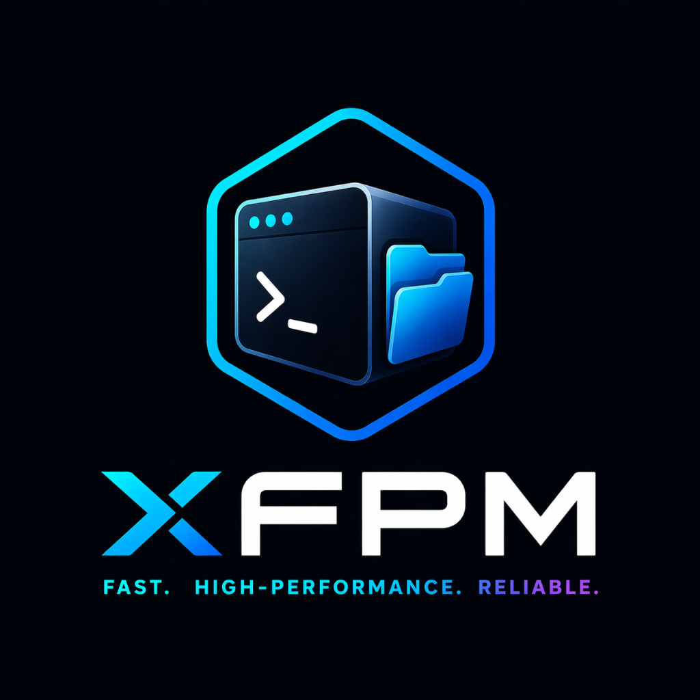

<p align="center">
  
</p>

# XFPM — XyPriss Fast Package Manager

> High-performance CLI package manager for the XyPriss ecosystem, built in Go.

---

## Table of Contents

- [Overview](#overview)
- [Features](#features)
- [Installation](#installation)
- [Usage](#usage)
- [Architecture](#architecture)
- [License](#license)

---

## Overview

**XFPM** is a cross-platform command-line tool designed for the XyPriss ecosystem. It delivers fast dependency resolution, strict package isolation through a virtual store, and a clean terminal interface suited for professional workflows.

---

## Features

| Feature              | Description                                                                                                     |
| -------------------- | --------------------------------------------------------------------------------------------------------------- |
| **Performance**      | Optimized resolution engine based on a neural dependency graph, written entirely in Go.                         |
| **Strict Isolation** | Content-addressable storage (CAS) and a virtual store architecture prevent dependency leakage between projects. |
| **Cross-Platform**   | Native binaries for Windows, Linux, and macOS — both `amd64` and `arm64`.                                       |
| **Clean Output**     | Structured, minimal terminal feedback with no visual noise.                                                     |
| **Auto-Update**      | Built-in update engine keeps the CLI current without manual intervention.                                       |
| **Security Audit**   | Standalone SCA engine with premium interactive reports and decentralized revocation enforcement.                |
| **Zero-Trust G3**    | Ed25519 cryptographic signing and verification layer for the secure plugin ecosystem.                           |
| **Single Binary**    | No runtime dependencies. One binary, fully self-contained.                                                      |

---

## Installation

XFPM is distributed through the official **Nehonix unified installer**.

### Unix / macOS / WSL

```bash
curl -sL https://xypriss.nehonix.com/install.js | node
```

### Windows (PowerShell)

```powershell
Invoke-RestMethod -Uri "https://xypriss.nehonix.com/install.js" -UseBasicParsing | node
```

### NPM

> **Note:** Administrative privileges are required to deploy the native binaries.

**Linux / macOS** — `sudo` and the `-g` flag are mandatory. Without `sudo`, the script cannot write to `/usr/local/bin`.

```bash
sudo npm install -g xypriss-cli
```

**Windows** — Run PowerShell or Command Prompt as **Administrator**.

```powershell
npm install -g xypriss-cli
```

---

## Usage

### Initialize a project

```bash
xfpm init
```

For detailed orchestration options and flags, see the [init command documentation](docs/commands/init.md).

### Manage dependencies

```bash
# Install from package.json
xfpm install

# Add a package
xfpm add <package>

# Add to devDependencies
xfpm add -D <package>

# Install from a local path
xfpm add file:./path/to/my-plugin

# Remove a package
xfpm rm <package>
```

### Update packages

```bash
# Update all packages
xfpm update

# Update a specific package
xfpm update <package>
```

### Dependency Audit

Audit your dependencies for known vulnerabilities via the OSV database and automatically repair them.

```bash
# Standard interactive audit
xfpm audit

# Advanced repair loop
xfpm audit fix

# Force a specific report mode
xfpm audit --tree  # Terminal tree view
xfpm audit --html  # Open interactive XFPML dashboard
```

#### Intelligent Fix Loop

The `audit fix` command performs a multi-step remediation:

1. **Registry Validation**: Compares local versions with NPM registry `latest`.
2. **Automated Repair**: Updates `package.json` and performs a clean installation.
3. **Re-Verification**: Automatically re-audits the project to confirm the fix is effective.
4. **Fallback Uninstallation**: Offers to remove packages that remain vulnerable even at their latest versions.

Use `--yes` and `--force-remove` for fully automated security enforcement in CI environments.

### Manage Plugins & Security

XFPM provides a robust suite of tools for managing project plugins and their cryptographic trust status within the Zero-Trust G3 architecture.

```bash
# List all plugins and their trust status
xfpm plugin list

# Advanced scan: identify all potential plugins in dependencies
# (Checks registry metadata and local installations)
xfpm plugin list --local   # Only check node_modules/vstore (offline)
xfpm plugin list --review  # Open web dashboard to review/update permissions

# Verify and authorize pending plugins
xfpm plugin verify
xfpm plugin verify --html  # Use beautiful interactive web dashboard

# Get detailed Developer Identity & Metadata for a plugin
xfpm plugin get <package...>
xfpm plugin id <package...>
xfpm plugin info <package...>

# Revoke trust and retire permissions
xfpm plugin revoke <package>
xfpm plugin revoke <package> --no-pending  # Clean removal without re-queueing
```

### Security & Signing (Zero-Trust G3)

XFPM enforces a cryptographically verified security model for the XyPriss ecosystem.

#### 1. Generate Identity

Authors must generate a unique Ed25519 developer identity before signing plugins.

```bash
xfpm gen-key
```

Your public key fingerprint should be published in your plugin's official README to allow users to verify your identity.

#### 2. Declare Privileges (Optional)

If your plugin requires protected system hooks (e.g., HTTP interception, sensitive config reads), you **must** declare them in your `package.json` before signing using the `xfpm.permissions` array. Ensure you use the exact system Privilege IDs.

```json
{
  "xfpm": {
    "permissions": [
      "XHS.HOOK.HTTP.REQUEST",
      "XHS.PERM.LOGGING.CONSOLE_INTERCEPT"
    ]
  }
}
```

During signature generation, XFPM validates these requested privileges against the official XyPriss definitions list. If they are syntactically invalid, signing is aborted.

#### 3. Sign Plugin Assets

Before publication, generate a tamper-proof signature manifest.

```bash
xfpm sign ./ --min-version 1.0.0
```

This hashes all production files and embeds your securely validated `Privileges` directly into a `xypriss.plugin.xsig` file required for safe distribution.

#### 4. Authorization & Interactive Verification

During the installation of a new plugin, XFPM defers validation to a batched interactive **Trust On First Use** (TOFU) flow triggered via `xfpm plugin verify`.

XFPM features a premium, web-based **Plugin Verification Dashboard** (`xfpm plugin verify --html`). This dashboard provides a beautiful and intuitive interface for:

- **Identity Verification**: Confirming the cryptographic Developer ID.
- **Granular Authorization**: Reviewing and selectively approving every requested system Privilege.
- **Bulk Management**: Processing dozens of plugins simultaneously with a responsive, high-performance UI.

Once approved, trust is pinned in the project's configuration file, and system hooks are securely activated.

#### 5. Manual Trust (CI/Automated)

For non-interactive environments or manual pinning, use the `trust` subcommand:

```bash
xfpm plugin trust <package> <developer-id>
```

#### 6. Non-Interactive Mode (CI & Automation)

For CI/CD and automation, XFPM supports a **Zero-Prompt** mode. Use the `--no-interact` (or `-n`) flag with `install`, `update`, or `verify`.

When this flag is active, XFPM will automatically trust any plugin that carries a **cryptographically valid G3 signature**, bypassing the manual Author ID confirmation prompt.

```bash
# Automated installation with verification
xfpm install -vn

# Automated verification of pending plugins
xfpm plugin verify --no-interact
```

Example:

```bash
xfpm plugin trust my-plugin ed25519:adl*******
```

#### 7. Configuration-Based Trust (trustedPlugins)

To bypass interactive prompts consistently without relying on the `--no-interact` flag globally, maintainers can whitelist specific plugin packages by declaring them in the project's root `package.json` under an `xfpm.trustedPlugins` array:

```json
{
  "xfpm": {
    "trustedPlugins": ["my-plugin"]
  }
}
```

This ensures a seamless development workflow for known, highly trusted plugins while maintaining strict verification for untrusted third-party additions. Additionally, the XyPriss configuration parser intelligently strips any trailing commas from `xypriss.config.jsonc` out-of-the-box ensuring smooth security configuration parsing.

### Dependency Audit & Revocation

Audit your dependencies for known vulnerabilities and enforced framework revocations.

```bash
# Standard interactive audit
xfpm audit

# Advanced repair loop
xfpm audit fix
```

#### Decentralized Revocation Enforcement

XFPM tracks framework-level revocations via native package metadata. If a version is discovered to be compromised:

- **Audit Flagging**: `xfpm audit` will mark the package as revoked.
- **Runtime Patching**: XFPM injects an `xfpm.revoked` marker into the local `package.json`, which is natively caught by the XHSC Deep Audit engine to block execution.

### Package Maintainers: Redirections & Deprecation

Library developers can natively manage package deprecations and redirect seamless installations across the XyPriss ecosystem without breaking workflows. If a package is renamed or deprecated, add an `xfpm` object to the distributed `package.json`:

```json
{
  "name": "old-lib",
  "version": "1.0.0",
  "xfpm": {
    "redirect": {
      "target": "new-lib",
      "message": "old-lib is deprecated. Please refer to our new architecture."
    }
  }
}
```

When users run `xfpm install old-lib`, XFPM intercepts the metadata, displays the custom message in the terminal, and securely shifts the resolution downstream to `new-lib`. The consuming application's `package.json` file is successfully updated to reference the designated `new-lib` target rather than the deprecated package.

---

## Architecture

XFPM resolves dependencies by building a **Neural Dependency Graph** of your project.

### CAS — Content Addressable Storage

Every file is hashed and stored once across the entire system within the global `~/.xpm/storage` directory, eliminating duplicates and ensuring deterministic installs.

### Virtual Store

Dependencies are rigorously stored by exact version under the project-local `node_modules/.xpm/vstore` and symlinked into the project's root `node_modules`. This "Ancestor Hoisting" architecture enforces strict isolation while avoiding ghost dependencies.

### Targeted Resolution & Lifecycle Execution

Only the modified portions of the dependency graph are recalculated during updates, minimizing overhead and keeping incremental operations fast. Additionally, XFPM invokes lifecycle scripts (e.g., `postinstall`) exclusively for the dependencies targeted in the current transaction, preventing unnecessary execution of ambient project scripts and preserving environment stability.

---

## License

Copyright 2025 **Nehonix**. All rights reserved.  
Licensed under the **Nehonix OSL (NOSL)**.

Powered by Nehonix.
